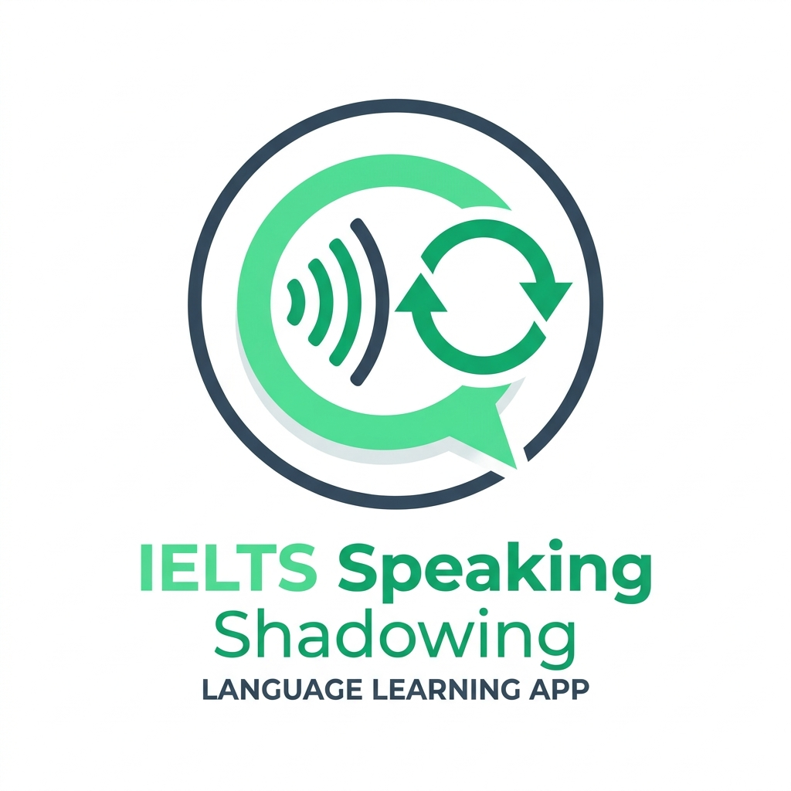

<p align="center">
  
</p>

# 🎙️ IELTS Speaking Shadowing Assistant (Duy - Durakla - Tekrar Et)

> **IELTS Band Seviyelerine Uygun Konuşma Pratiği için Masaüstü Gölgeleme (Shadowing) Asistanı**

[](https://www.python.org/downloads/)
[](https://riverbankcomputing.com/software/pyqt/)
[](https://aistudio.google.com)
[](https://github.com/rany2/edge-tts)
[](https://github.com/jiaaro/pydub)
[](https://github.com/sametburhan/ielts-shadowing-app/releases)
[](LICENSE)

---

## 🎯 Projenin Amacı ve "Duy - Durakla - Tekrar Et" Metodolojisi

IELTS Speaking sınavında Band 7 ve üzeri puan almanın en kritik unsurları; **akıcılık (fluency)**, **doğal ritim & tonlama (intonation)** ve **ileri düzey kelime/kalıp kullanımıdır (lexical resource)**.

Düz bir dinleme metninde konuşmacıyı takip etmek zordur. Bu uygulama, dil öğreniminde kanıtlanmış **Shadowing (Gölgeleme)** tekniğini otomatikleştirir:

1. **Akıllı Cümle/Öbek Parçalama:** Google Gemini LLM, verilen konu hakkında IELTS Part 1, 2 veya 3 formatında Band 7+ bir cevap oluşturur ve bunu konuşma diline uygun doğal nefes öbeklerine (*breath chunks*) böler.
2. **Doğal Nöral Ses Sentezi:** Microsoft Edge Neural TTS motoru ile her öbek doğal İngiliz veya Amerikan aksanıyla seslendirilir.
3. **Dinamik Sessizlik (Pause) Ekleme:** `pydub` ses motoru her parçanın süresini milisaniye cinsinden ölçer ve parçanın hemen ardına **1.3 katı kadar sessizlik** yerleştirir.
4. **Kullanıcı Tekrarı:** Kullanıcı önce orijinal ses tonlamasını duyar, ardından eklenen sessizlik esnasında cümleyi yüksek sesle birebir taklit ederek tekrar eder.
5. **Senkronize Arayüz:** Ses çalarken arayüzde o an okunan ve tekrar edilen adım yeşil renkle dinamik olarak parlar.

---

## 🖥️ Arayüz Tasarımı ve Bileşenleri

Arayüz, modern ve minimalist bir kullanıcı deneyimi sunar:

```
+------------------------------------------------------------------------------------+
| 🎙️ IELTS Speaking Shadowing Assistant                                     [_][□][X]|
+------------------------------------------------------------------------------------+
| [ Random Konu Girdisi (örn: Public Transport)           ] [🎲 Rastgele] [✨ Generate]|
| [ Gemini Key: ************* [✓ Göster] [Kaydet] ] [Aksan: British ▾] [Duraklama: 1.3x] |
+------------------------------------------------------------------------------------+
| [ Part 1 (Interview) ]  |  [ Part 2 (Cue Card) ]  |  [ Part 3 (Discussion) ]       |
+------------------------------------------------------------------------------------+
|                                                                                    |
|  📝 Konuşma Scripti (Duy - Durakla - Tekrar Et)                 [ Metni Kopyala ]  |
|  +------------------------------------------------------------------------------+  |
|  | Part 1: Introduction • Konu: Public Transport                               |  |
|  | Soru: Do you often use public transport in your daily routine?               |  |
|  +------------------------------------------------------------------------------+  |
|  | 💡 Band 7+ Lexical Notes: Idiomatic collocations like 'vibrant atmosphere'  |  |
|  +------------------------------------------------------------------------------+  |
|  | ADIM 1  ▶ ŞU AN ÇALIYOR                                                      |  |
|  | What I appreciate most is its vibrant atmosphere,                            |  |
|  | (En çok takdir ettiğim şey onun canlı atmosferi,)                             |  |
|  +------------------------------------------------------------------------------+  |
|  | ADIM 2                                                                       |  |
|  | because it has a great blend of historic charm and modern amenities.        |  |
|  | (çünkü tarihi cazibe ve modern olanakların harika bir karışımına sahip.)     |  |
|  +------------------------------------------------------------------------------+  |
|                                                                                    |
+------------------------------------------------------------------------------------+
| [🎧 Part 1 Shadowing ] [ ───●────────────────────────── ] 00:18 / 01:24  [1.0x ▾] [▶]|
+------------------------------------------------------------------------------------+
```

---

## 🚀 Kurulum Adımları

### 1. Depoyu Klonlayın veya İndirin
```bash
cd c:\Users\samet\Desktop\ielts
```

### 2. Python Sanal Ortamını (venv) Oluşturun ve Aktifleştirin
```powershell
python -m venv venv
.\venv\Scripts\Activate.ps1
```

### 3. Bağımlılıkları Yükleyin
```bash
pip install -r requirements.txt
```

> **Not:** Windows'ta harici FFmpeg kurulumu ile uğraşmamanız için `imageio-ffmpeg` ve `static-ffmpeg` entegre edilmiştir. Ekstra bir codec veya ffmpeg.exe kurmanıza gerek kalmadan doğrudan çalışır.

### 4. Google Gemini API Anahtarınızı Alın
- [Google AI Studio](https://aistudio.google.com) adresine gidin.
- Ücretsiz bir API Key oluşturun.
- İster uygulama arayüzündeki **Gemini Key** kutusuna yapıştırıp **Kaydet** butonuna basın, isterseniz `.env` dosyası oluşturup içine ekleyin:
  ```env
  GEMINI_API_KEY=AIzaSy...
  ```

### 5. Uygulamayı Başlatın
```bash
python main.py
```

### 📦 Taşınabilir (Portable) EXE İndirme ve Çalıştırma
Uygulama, Python kurulumuna veya ek bağımlılıklara ihtiyaç duymadan doğrudan Windows üzerinde çalışabilen tek parça portable `.exe` olarak sunulmaktadır:

1. **Doğrudan İndirin:** [GitHub Releases](https://github.com/sametburhan/ielts-shadowing-app/releases) sayfasından en son sürümdeki `IELTS_Shadowing_Assistant.exe` veya `.zip` arşivini indirin.
2. **Çalıştırın:** Dosyaya çift tıklayarak hemen kullanmaya başlayabilirsiniz.
3. **Ayarlar:** API anahtarınız ve kullanıcı tercihleriniz Windows `AppData/Roaming` dizininde güvenle saklanır, böylece güncellemelerde kaybolmaz.

#### ⚙️ Yerel Olarak EXE Derleme:
```bash
pyinstaller IELTS_Shadowing_Assistant.spec --clean --noconfirm
```
Derlenen dosya `dist/IELTS_Shadowing_Assistant.exe` konumunda oluşturulur.

#### 🤖 GitHub Actions ile Otomatik Release Alma:
Depoda yapılandırılmış GitHub Action iş akışı (`.github/workflows/release.yml`) sayesinde sürümler otomatik derlenip GitHub Release olarak yayınlanır:
- **Etiket (Tag) ile Otomatik Yayın:** Bir sürüm etiketi (`v*`) gönderildiğinde otomatik tetiklenir:
  ```bash
  git tag v1.0.0
  git push origin v1.0.0
  ```
- **Manuel Tetikleme (Workflow Dispatch):** GitHub arayüzünden **Actions** > **Build and Release Portable EXE** sekmesine gidip **Run workflow** butonuna tıklayarak istediğiniz etiket ve başlıkla tek tıkla derleme ve release başlatabilirsiniz.

---

## 🧩 Test ve Doğrulama

Ses motorunun ve duraklatma sürelerinin doğruluğunu izole olarak test etmek için:

```bash
python tests/test_audio_shadowing.py
```

Bu test:
- Örnek Band 7 İngilizce cümleleri `edge-tts` ile çeker.
- Her parçanın süresini ölçüp $1.3\times$ sessizlik ekler.
- `tests/test_output.mp3` dosyasını oluşturur ve doğrulama raporunu ekrana basar.

---

## 📂 Proje Dizin Yapısı

```
ielts/
├── main.py                     # Uygulama ana giriş noktası
├── requirements.txt            # Python bağımlılıkları
├── config.json                 # Kullanıcı tercihleri ve API anahtarı (otomatik oluşur)
├── README.md                   # Proje dokümantasyonu
│
├── src/
│   ├── config.py               # Ayarlar, ses listesi ve kalıcı yapılandırma
│   ├── llm/
│   │   ├── prompts.py          # Part 1, Part 2 (Cue Card) ve Part 3 prompt şablonları
│   │   └── gemini_client.py    # Yapılandırılmış JSON Gemini API istemcisi
│   ├── audio/
│   │   └── shadow_engine.py    # edge-tts + pydub sessizlik birleştirme motoru
│   ├── ui/
│   │   ├── main_window.py      # PyQt6 Ana Pencere
│   │   ├── player_bar.py       # QMediaPlayer ses kontrol çubuğu
│   │   ├── script_viewer.py    # Çift dilli interaktif konuşma metni görüntüleyici
│   │   └── styles.py           # Modern QSS stil teması ve HTML şablonları
│   └── workers/
│       └── pipeline_worker.py  # Arayüzü dondurmayan asenkron QThread işçisi
│
├── tests/
│   └── test_audio_shadowing.py # İzole ses motoru birim testi
└── cache/                      # Üretilen geçici MP3 ses dosyaları
```

---

## ⚙️ Yapılandırma Seçenekleri

| Ayar | Seçenekler | Açıklama |
|---|---|---|
| **Aksan / Ses** | British (Sonia/Ryan), American (Jenny/Guy), Australian (Natasha) | IELTS için İngiliz veya Amerikan aksanını seçebilirsiniz. |
| **Hedef Band** | Band 1-4 (Temel), Band 4.5-5.5 (Orta), Band 6-7 (İleri), Band 7.5+ (Uzman) | Yapay zekanın üreteceği cümlenin gramer karmaşıklığını ve kelime dağarcığını belirler. |
| **Tekrar Duraklaması** | 1.2x (Hızlı), 1.3x (Önerilen), 1.5x (Geniş) | Her cümlenin ardından konuşmanız için ayrılan sessizlik katsayısı. |
| **IELTS Bölümü** | Part 1, Part 2, Part 3 | İlgili bölümün sınav formatına ve uzunluğuna uygun içerik üretir. |

---

## 📜 Lisans

Bu proje MIT lisansı altında sunulmaktadır.
